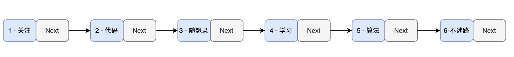
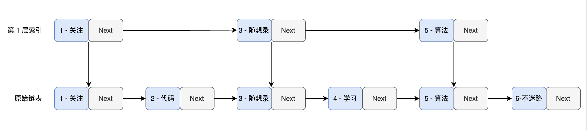
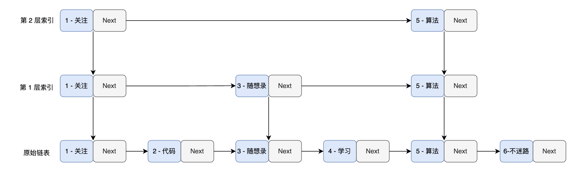
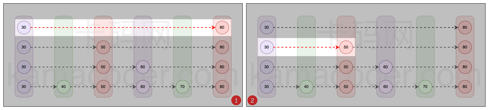
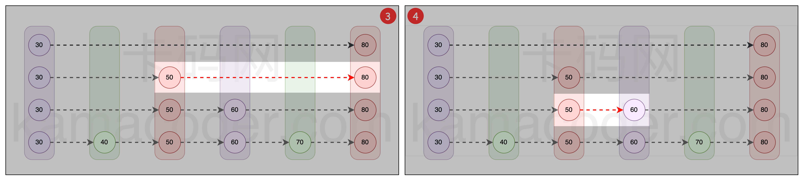
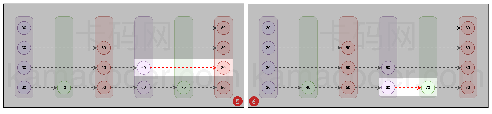
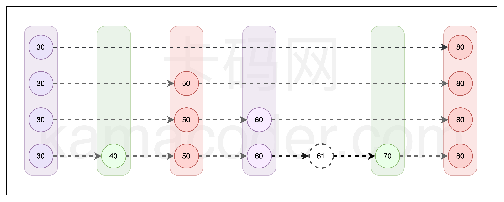
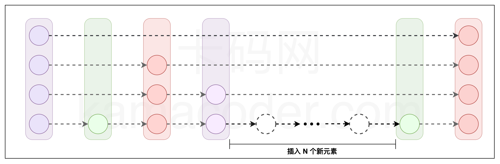
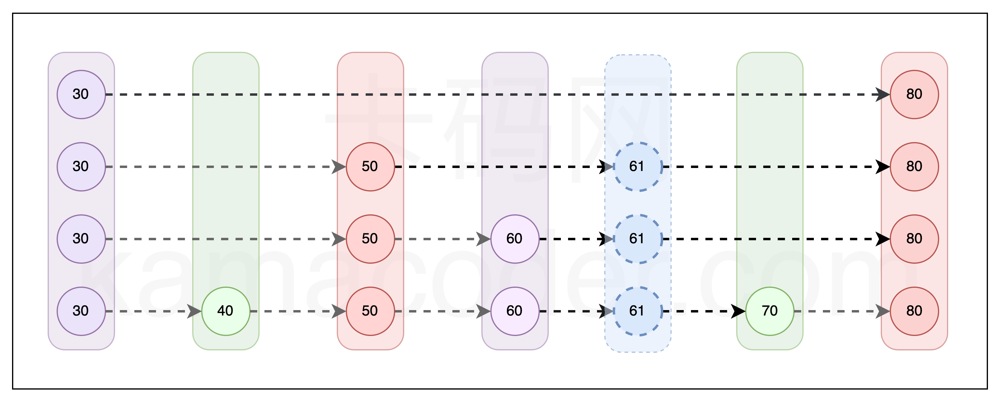

# 跳表项目
## 一. 跳表简介 
1. 存储引擎项目结构

    1.1. 拥有两个核心类：Node 类 和 SkipList 类--->Node 类是存储引擎中用于存放实际数据的类，而 SkipList 则对外提供了组织，访问，操作 Node 类的功能。

    1.2. 应用的技术

        1.2.1. 面向对象，类模板，IO操作，多线程（压测）

2. 什么是跳表

- 本项目中采用的数据结构 — 跳表，我们必须从其基础出发：链表。链表是许多复杂数据结构的基石，在这其中也包括了跳表。


> 跳表（Skip List）是由 William Pugh 发明的一种数据结构，他本人对跳表的评价是：“跳跃列表是在很多应用中有可能替代平衡树而作为实现方法的一种数据结构。跳跃列表的算法有同平衡树一样的渐进的预期时间边界，并且更简单、更快速和使用更少的空间。”

如果是有序链表作为基础构建的话，在这样的设置下数据结构是这样的特点


其中每个节点都存储着一对键值对。为了便于理解，假设其中键是数字，值是字符串，并且它们按键的顺序排列。

这便构成了一个基于有序链表的简易键值（K-V）存储引擎。

设想现在我们需要在存储引擎中查找特定键（比如 key = 6）对应的值。由于单链表的线性结构，我们不得不从头节点开始，逐个遍历节点。

例如，在查找 key = 6 的过程中，我们需要按顺序检查每个节点，即查找路径为 1 -> 2 -> 3 -> 4 -> 5 -> 6。这种方法的时间复杂度为 O(n)，在数据量庞大时效率低下。

因此，需要一种更高效的查找方法，而跳表正是这样的一种解决方案。

> 明确前提：我们实现的都是基于链表是有序的前提

提升查找速度的方法：从原链表中选取关键节点作为索引层。这些被选出的节点形成了一个新的，较原链表更为简短的链表。

*  **从原链表中选取关键节点作为索引曾。那这些被选出的节点形成一个新的，较原链表更为简短的链表** 由于原链表本身是有序的，索引层中的节点也同样保持有序，利用这个有序性，我们能够加快查找速度。



例如查找key=6，在传统单链表里面是从头至尾逐个检查节点。例如，我们首先比较 key = 1 的节点，发现它小于 6，然后继续比较 key = 2 的节点，如此循环。

但在跳表中，情况就大不相同了。我们首先检查第一层索引，比较 key = 1 的节点后，可以直接跳到 key = 3 的节点，因为 6 大于 3，我们再跳到 key = 5 的节点。在这个过程中，我们省略了与 key = 2 和 key = 4 的节点的比较，但实际上，通过与 key = 3 和 key = 5 的比较，我们已经间接地排除了它们。

如此一来，查找路径缩短为 1 -> 3 -> 5 -> 6。与原始的单链表相比，效率有所提升。那么，如果我们在第一层索引上再构建一层索引会怎样呢？



当我们从第二层索引开始进行查找时，查找会变得更加高效。在比较了 key = 1 的节点 和 key = 6 的节点后，我们不再逐个检查 key = 2、key = 3 和 key = 4 的节点，而是直接跳到 key = 5 节点进行比较。如此一来，整个查找路径便缩短为 1 -> 5 -> 6。

> 如果在每层索引中，每两个节点就有一个被提升为上一层的索引，那么查找的时间复杂度可以降至 O(log n)，这与二分查找的效率相仿。

> 这样的机制不仅显著提升了查找效率，还在保持链表灵活性的同时，为我们的存储引擎带来了接近二分查找的高效性能。

3. 如何搜索节点

* 搜索流程

    1. 开始至于顶层搜索索引：首先定位到跳表的最顶层的索引的首个节点
    2. 水平遍历：从最顶层的首个节点开始向右遍历。如果当前节点的下一个节点的值小于或等于待查找的值，表明该节点左侧的所有节点都小于或等于待查找值，此时跳转到下一个节点
    3. 下沉操作：若当前节点的下一个节点的值大于待查找值，意味着所需查找的节点位于当前位置左侧的某处，此时执行下沉操作，即向下移动到较低层的同一位置
    4. 重复查找与下沉：继续执行第二步和第三步的操作，直到到达最底层链表。在此层继续向右移动，直到找到目标节点或达到链表末端

例如：查找值为70，模拟查找流程



如图一所示，从最顶层开始，首个节点为 30，既然 30 小于 70，我们继续向右，比较下一个节点 80。发现 80 大于 70，此时，我们需要执行下沉操作，移动到下一层索引，如图二所示。

在图二中，我们比较节点 50 与 70。由于 50 小于 70，我们向右移动到下一个节点，如图三所示。



在图三，我们继续比较节点 50 的下一个节点 80 与 70。由于 70 小于 80，再次执行下沉操作，如图四所示。

在图四，我们将节点 60（即 50 的下一个节点）与 70 进行比较。此时，70 大于 60，因此我们向右移动，结果如图五所示。



到了图五，我们比较节点 60 的下一个节点 80 与 70。由于 70 小于 80，我们再次下沉到更底层的索引，如图六所示。

最后，在图六中，我们比较节点 60 的下一个节点 70。发现我们已经成功找到了目标值 70，此时查找成功。

4. 节点的有序性


因为跳表的所有节点都是有序排列的，无论是插入还是删除操作，都必须维持这种有序性。

> 这一点使得跳表具有与平衡树相似的特性，即它的任何操作都密切依赖于高效的查询机制。

为了维护跳表中节点的有序性，我们必须先通过搜索找到一个合适的位置进行操作。

以插入一个新节点为例，假设我们需要插入数值为 61 的节点。如下图所示，在执行跳表的搜索操作后，我们可以定位到一个特定的区域：此区域的左侧节点值小于 61，而右侧节点值大于 61。在确定了这一位置之后，我们便可在此处插入新节点 61。



实际上，我们已经成功地在跳表中插入了一个节点，并且能够有效地搜索到这个节点。

然而，如果我们持续向跳表中添加数据，而忽视对索引的更新，这将导致跳表效率的显著退化。在最极端的情况下，这种效率下降甚至可能使跳表的查询效率降至 O(n)，与普通链表的查询效率相当。


    
4.2.  插入数据需要维护索引

为了保持跳表的高查询效率，其索引必须进行动态更新。

每次插入新节点时，删除所有现有索引，并从每两个节点中抽取一个作为新索引，再逐层执行此操作。虽然这个方法概念上简单，但实际上它效率低下，并且实现起来相当复杂。

4.3. 随机过程决定索引层级

跳表的索引构建是一个层层递进的过程。理想情况下，在原始链表中，我们每隔一个节点选择一个作为上层的索引。然后，把这一层的索引视为新的基础链表，重复同样的选择过程，直到顶层索引仅包含两个节点。

换句话说，由于任何节点都有一半的概率被选为上层的索引，一个节点出现在不同层级的概率呈逐层减半的趋势。例如，一个节点在第 1 层的出现概率是 100%，在第 2 层是 50%，在第 3 层是 25%，以此类推。

> 在跳表中，如果一个节点出现在较高层级，它必然出现在所有较低的层级。例如，一个节点若出现在第 3 层，那么它必定存在于第 2 层和第 1 层。

所以，我们可以在节点插入的时候，就通过某种随机分层机制，确定它所在的层级。

而这种机制需要保证每个节点有 100% 的概率出现在第 1 层，50% 的概率出现在第 2 层，25% 的概率出现在第 3 层，依此类推，通过这种概率分布，我们能有效地平衡跳表的层级结构和搜索效率。

```c++
int randomLevel() {
    int level = 1;
    while (random() % 2) {
        level++;
    }
    return level;
}//用于确定跳表中节点的层数
//random() 函数每次生成一个随机数。如果这个随机数是奇数，节点的层级就增加 1；如果是偶数，循环结束并返回当前层级 level。我们可以假设 random() 生成的奇数和偶数的概率各为 50%。

//因此，节点层级增加到 2 的概率是 50%。而层级增加到 3 的概率，即连续两次产生奇数，概率为 25%，以此类推。
```

具体示例：如果我们查数值为61的节点，用randomLevel()方法返回了3，表示它会出现在第一层，第二层第三层。



* 应用到跳表中，随着节点数量的增加，我们可以合理地假设每一层的节点数量大约是下一层的一半。这是因为每个节点在每一层出现的概率都是前一层的一半。因此，通过这种方法，跳表的索引能够得到有效的维护，保持其结构和效率。

5. 删除跳表里面的节点

* 需要先查询，查询搜索到想要的节点，然后将该节点以及该节点的索引一并删除

6. 应用跳表的工业软件

Redis：这是最著名的使用跳表的例子。Redis 是一个开源的高性能键值存储数据库，广泛用于缓存和消息队列等场景。在 Redis 中，跳表被用于实现有序集合（sorted sets）数据类型，这主要是因为跳表在处理有序数据时可以提供良好的性能，尤其是在插入、删除和搜索操作上。

LevelDB：LevelDB 是一个由 Google 开发的快速键值存储库，用于存储非结构化数据。它使用跳表作为其内存中的数据结构，以支持快速的写入操作。跳表在 LevelDB 中帮助实现高效的数据插入和排序。

RocksDB：RocksDB 是 LevelDB 的一个分支，由 Facebook 进行了大量优化。它同样使用跳表来处理内存中的数据，以优化读写操作的性能。

Apache HBase：HBase 是一个分布式、可伸缩的大数据存储，基于 Google 的 BigTable 模型。在 HBase 中，跳表被用于实现 MemStore，即内存中的存储结构，以支持快速的数据写入和读取。


## 二. 跳表的定义

* Node 类与 SkipList 类。Node 类的核心在于其属性，特别是其 forward 属性。可以说理解了 forward 属性，就理解了整个 K-V 存储引擎底层使用数据结构 —— 跳表。

### 1. Node类

1. Node类节点时候，我们需要考虑三个因素

> 为了明确语义以及方便叙述，后文中所有的名词「节点」都是代指 Node 类，更具体的来说是指 Node 类的实例。

```
1. 键值存储机制：如何存储键和对应的值
2. 跳转机制实现：跳表的搜索操作核心在于节点间的跳转，这如何实现
3. 层级确定：如何确定节点存在于跳表中的哪些层级
```

Node类主要两个私有元素：key和value，分别存储键和值

此外，Node 类还有一个 node_level 公共属性，用于标识节点在跳表中的层级位置。

* 当 node_level = 1 时，表示当前的节点只会出现在跳表中的第 1 层
* 当 node_level = 2 时，表示当前的节点会出现在跳表中的第 2 层和第 1 层
* 以此类推

具体代码实现看 skiplist.h

Node 类中负责键值存储和标识节点层次的属性之后，下文将会介绍用于支持节点间跳转机制的属性

> 所谓跳转，指的是通过定义一种特定的指针机制，使得该指针能够以一定规则指向跳表中的各个节点。以单链表为例，其 next 指针便是一种实现节点间顺序跳转功能的关键属性

在 “跳表简介” 章节中模拟跳表搜索部份，我们知道节点间的跳转机制可以分为两大类：

1. 同一节点的多层跳转：在相同键值、不同层级节点之间的跳转（上下层跳转）
2. 不同节点的单层跳转：在相同层级、不同键值节点之间的跳转（左右跳转）

> 就像通过 x 坐标和 y 坐标结合，可以表示坐标轴内上的任意一个点一样。

本节先实现第二种跳转：不同节点的单层跳转。实际上也跟单链表的结构类似

在单链表中，每个节点由两部分组成：数据域和指针域。数据域负责存储当前节点的值，而指针域则指向下一个节点，将各个单独的节点链接起来。

实现链表结构LinkList

```c++
class LinkList {
  int data;
  LinkList* next;
}
```

在单链表的结构中，可以通过访问当前节点的 next 指针，来实现从当前节点到下一个节点之间跳转的功能。这个 next 指针指向链表中的后续节点，从而使我们能够从当前节点顺利跳转到紧随其后的节点。

```c++
// 单链表实现节点跳转的简单实现
void travasal(LinkList* listHeader) {
    LinkList* current = listHeader;
    while (current->next != nullptr) {
        current = current->next;
    }
}
```
所以，我们可以借鉴单链表中访问 next 指针的成员函数，来实现跳表内同一层级上不同节点间的跳转功能。也就是说，节点内部用于支持跳转功能的属性，实质上是一种指针。这个指针将会指向 **当前节点同一层中的后一个节点** 。

**queation2:如何支持节点在其不同层级间的跳转呢？**

可以通过 node_level 属性确定一个节点会在跳表的哪些层级出现。基于这个点，我们可以根据数据结构来组织一个节点在不同层级的指针。这意味着，用于支持两种跳转功能的属性，实际上是一个指针数组，数组其中的每个指针对应节点在一个特定层级的后继节点。通过变更数组下标，我们便能够实现同一节点在不同层级之间的跳转功能。这样的设计不仅保持了结构的简洁性，也为跳表提供了必要的灵活性和效率。

为了保持一致性和易于理解，我们将这个指针数组命名为 forward，这个命名方式与大多数跳表实现中的惯例相同。

> 假设一个节点在跳表中的层级为 3，那么这个节点的 forward 指针数组的大小为 3。其 forward[0] 指向该节点在第一层的下一个节点；forward[1] 指向该节点在第二层的下一个节点，forward[2] 指向该节点在第三层的下一个节点。

完成节点的最终定义后，我们再介绍这个结构的跳转机制是如何运作的。

#### **同一层级内节点的跳转：**
```c++
/**
 * 遍历跳表的底层链表
 * current : 指向当前遍历节点的指针
 */
Node<K,V>* current = head; // 假设 head 是跳表第一层的头节点
while (current->forward[0] != nullptr) {
    // 通过迭代的方式，实现同一层内的不同节点之间的跳转
    current = current->forward[0];
}
```

#### **不同一层级内同一节点的跳转：**

```c++
/**
 * 同一个节点，不同层级之间的跳转
 * node : 当前节点
 * n : 节点所在的最高层级
 */
Node<K,V>* node; // 假设 node 是当前节点
int n = node->forward.size(); // 假设 forward 是动态数组
for (int i = n - 1; i >= 0; i--) {
    // 通过变更数组下标进行同一个节点在不同层级之间的跳转
    Node<K,V>* current = node->forward[i];
}
```

#### Node类代码实现

详细看skiplist.h

### SkipList类

1. SkipList属性

    1. 头节点：作为跳表中所有节点组织的入口点，类似于单链表
    2. 最大层数：跳表中允许的最大层数
    3. 当前层数：跳表当前的层数
    4. 节点数量：跳表当前的组织的所有节点总数
    5. 文件读写：跳表生成持久化文件和读取持久化文件的写入器和读取器

2. SkipList成员函数

1. 节点创建：生成新的节点实例
2. 层级分配：为每个新创建的节点分配一个合适的层数
3. 节点插入：将节点加入到跳表中的适当位置
4. 节点搜索：在跳表中查找特定的节点
5. 节点删除：从跳表中移除指定的节点
6. 节点展示：显示跳表中所有节点的信息
7. 节点计数：获取跳表中当前的节点总数
8. 数据持久化：将跳表的数据保存到磁盘中
9. 数据加载：从磁盘加载持久化的数据到跳表中
10. 垃圾回收：对于删除的节点，需要回收其内存空间
11. 获取节点数量：获取跳表组织的节点个数

## 跳表的层级

1. 随机层级的选择过程

随机过程的结果是：

许多元素会停留在较低的层级，一部分元素会到达较高的层级，极少数的元素会到达非常高的层级。

2. 采用随机过程的原因

* 平衡性：随机层级分配自然保持跳表平衡，无需额外操作（如AVL或红黑树的旋转）
* 效率：随机分配层级保证节点在各层均匀分布，实现对数时间复杂度的查找、插入和删除
* 简单性：这种方法易于实现且效果显著，使跳表成为性能优异的简洁数据结构

这是因为在具体的实现中，我们的跳表有一个最大层级限制，限制了索引的最高层，所以这里额外添加一行代码对随机生成的层级进行限制。

这个函数通过简单的随机过程（模拟抛硬币），以概率方式决定节点的层级，同时确保层级不会超过设定的最大值。这种随机层级分配策略有助于保持跳表的性能，确保操作（如搜索、插入、删除）的时间复杂度在平均情况下接近 O(log n)。